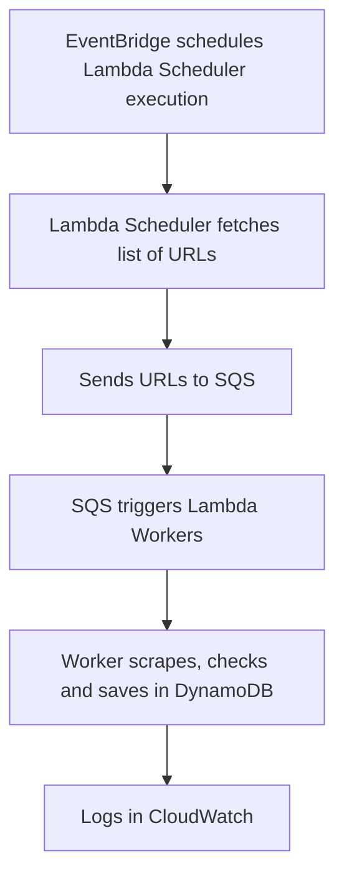

# Serverless Scraper AWS with Terraform

[](https://github.com/edmolima/maracanaunews/actions)
[](LICENSE)
[](https://open.vscode.dev/edmolima/maracanaunews)
[](https://github.com/edmolima/maracanaunews/commits/main)
[](https://github.com/edmolima/maracanaunews/issues)

This repository contains infrastructure as code (Terraform) and Lambda code examples for a distributed news scraper from maracanet.com (Maracanaú).

## Features
- Modular, production-ready serverless architecture
- Fully automated deployment with GitHub Actions (OIDC, least privilege)
- Clean, idempotent scraping logic
- Minimal AWS cost configuration
- English documentation and code
- Open source ready and secure by design

## Security & Open Source Best Practices
- **No secrets or credentials are versioned.** Only placeholders in `.env.example`.
- **OIDC role for CI/CD** uses least privilege and is restricted to ARNs dos recursos do projeto.
- **S3 state bucket is private** and never public.
- **No public endpoints** are exposed by default.
- **All IAM policies** are scoped to only the resources needed (Lambda, SQS, DynamoDB, CloudWatch, S3).
- **Contributors must never commit real secrets.**
- **Security reporting:** See [SECURITY.md](SECURITY.md).

## Architecture
- **EventBridge** schedules execution of the Lambda Scheduler (every 1 hour)
- **Lambda Scheduler** fetches news URLs and sends them to the **SQS** queue
- **SQS** stores and distributes URLs for processing
- **Lambda Worker** scrapes, checks for duplicates in **DynamoDB**, and saves new news
- **CloudWatch** receives detailed logs


## Repository Structure
- `infra/` — Terraform files for AWS provisioning
- `packages/` — All Lambda function source code (Node.js, TypeScript)
- `lambdas/` — Built and zipped Lambda artifacts for deployment (auto-generated by CI/CD)
- `.github/workflows/` — All GitHub Actions workflow definitions (CI/CD, infra, Lambda)
- `.github/actions/` — Custom composite actions (e.g., build-zip-lambdas)
- `.github/` — Copilot instructions, funding, and community files

## Quick Start

### Prerequisites
- [Terraform](https://www.terraform.io/downloads.html)
- [AWS CLI](https://aws.amazon.com/cli/)
- [Node.js](https://nodejs.org/)
- AWS account and credentials


### Setup
1. Clone this repository
2. Configure your AWS credentials (`aws configure`)
3. Build and zip all Lambdas (locally or via CI/CD):
   ```sh
   pnpm install
   pnpm -F @maracanaunews/lambda build
   pnpm -F @maracanaunews/worker build
   pnpm -F @maracanaunews/scheduler build
   # Or use the composite action in .github/actions/build-zip-lambdas
   ```
4. Deploy infrastructure:
   ```sh
   cd infra
   terraform init
   terraform apply
   ```
5. Monitor logs in AWS CloudWatch


## Usage
- The scheduler Lambda runs every hour (EventBridge rule)
- All logs are available in CloudWatch
- Infrastructure is optimized for minimal AWS cost
- All build/zip/deploy logic is DRY and managed via workflows in `.github/workflows/` and actions in `.github/actions/`

## Flowchart



## Multi-source Pattern (Best Practice)
- All scrapers share the same SQS queue and DynamoDB table.
- Each message/item includes a `source` attribute (e.g., `maracanet`, `othersource`).
- This enables easy scaling and management of multiple sources with minimal AWS resources.
- To add a new source, add a new package in `packages/`, set a new `SOURCE` value in your Lambda environment and code, and update the build/zip logic if needed.

## Managing Secrets (Best Practice)
- Store all sensitive values (API keys, credentials) in a local `.env` file (never commit this file).
- Use `.env.example` as a template for required variables—values should be random placeholders only.
- Add `.env` to `.gitignore` to prevent accidental commits.
- Never store real secrets in version control or public repositories.

### Example: .env.example
```
AWS_REGION=us-east-1
DYNAMODB_TABLE=table_example_123
SQS_QUEUE_URL=https://sqs.us-east-1.amazonaws.com/123456789012/example-queue-abc
SOURCE=example_source
MY_API_KEY=exampleapikey1234567890
```


## Remote Terraform State (Production Setup)
- This project uses an S3 backend for Terraform state. Edit `infra/main.tf` and set your S3 bucket name.
- The S3 bucket is private and only accessible by the OIDC role with least privilege.
- To migrate local state to S3, run:
  ```sh
  cd infra
  terraform init
  # Follow prompts to migrate state
  ```
- If you already have AWS resources, import them into state:
  ```sh
  terraform import module.dynamodb.aws_dynamodb_table.this news-maracanet
  terraform import module.iam_worker.aws_iam_role.this scraper-worker-role
  terraform import module.iam_scheduler.aws_iam_role.this scraper-scheduler-role
  terraform import module.lambda_worker.aws_cloudwatch_log_group.this /aws/lambda/scraper-worker
  terraform import module.lambda_scheduler.aws_cloudwatch_log_group.this /aws/lambda/scraper-scheduler
  terraform import module.cloudwatch.aws_cloudwatch_log_group.this /aws/lambda/scraper-maracanet
  ```
- After migration/import, your CI/CD will only update Lambda code and never try to recreate existing infra.

## Community & Discussions
- Questions, ideas, and feedback are welcome in [GitHub Discussions](https://github.com/edmolima/maracanaunews/discussions)


## Contributing
See [CONTRIBUTING.md](CONTRIBUTING.md) for guidelines. All contributions are welcome!
All workflow and action logic is in `.github/workflows/` and `.github/actions/`.

## Code of Conduct
See [CODE_OF_CONDUCT.md](CODE_OF_CONDUCT.md).

## Security
- This project does **not** expose any public endpoints by default.
- All Lambda triggers are internal (EventBridge, SQS).
- SQS queue access is restricted to your AWS account and the worker Lambda only.
- IAM roles follow least privilege and are scoped to project resources only.
- For any future API or public endpoint, use authentication, throttling, and AWS WAF.
- Monitor usage and set CloudWatch alarms for unusual activity.

See [SECURITY.md](SECURITY.md) for vulnerability reporting.

## License
[MIT](LICENSE)

## Funding
If you find this project useful, consider supporting via [GitHub Sponsors](https://github.com/sponsors/edmolima) or [Buy Me a Coffee](https://www.buymeacoffee.com/edmolima).
